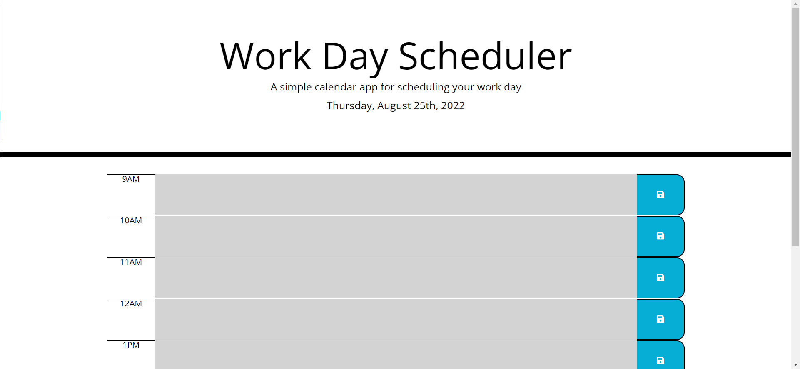

# Work Day Scheduler

## Description

This is the Work Day Scheduler web application. These files are for review for the Module 5 Challenge.

## Installation

N/A

## Usage

This web app has been created with the following functionality:

1. Current day and date displayed at top of screen.

2. User can enter events each hour from 9am to 5pm.

3. Past events are shown in gray, present time is shown in red, and future events in green.

4. User can save individual events and go back to them at a later time.

## Screenshot/Link

[Work Day Scheduler](https://cray412.github.io/Work-Day-Scheduler/)

## Credits

N/A

## License

Please refer to the LICENSE in the repo.